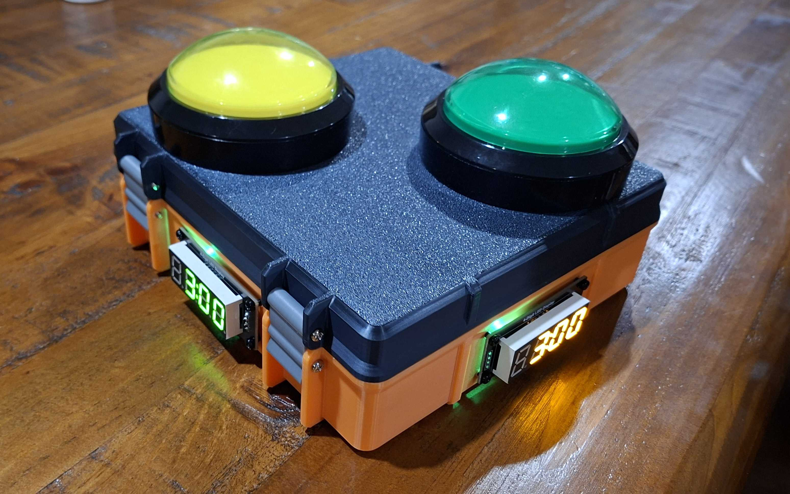
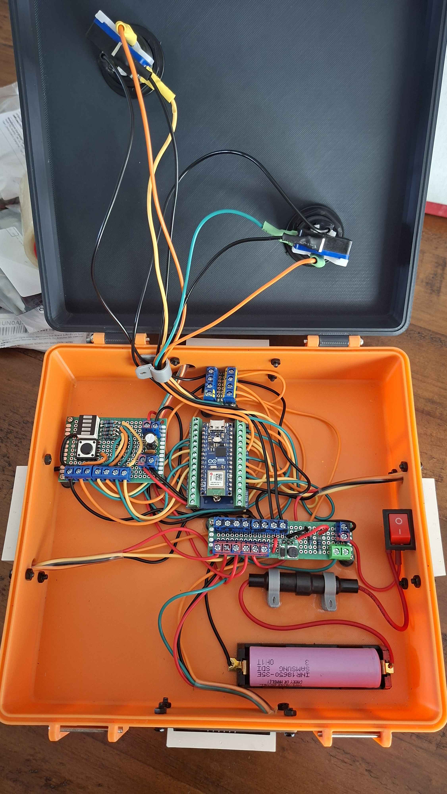

# KOTH-Timer

A DIY ESP32-based King of the Hill timer for Nerf, foam flinging, and objective based skirmish games.

This project is based on my working prototype that has been used successfully at local Nerf events. A few people in the hobby scene asked how to build their own, so this repo exists to make that possible.

The goal is to keep it practical, buildable, and easy to modify.

---

## Prototype Photos

### Finished Prototype



### Inside Wiring



---

## What It Does

OpenKOTH Timer is a physical objective timer for two-team King of the Hill style games.

Players press their team’s button to capture the objective. The timer tracks control time and shows the game state through the local web interface (via an admin phone) and button LEDs.

It is designed to run locally from an ESP32, so it does not need internet access once set up.

---

## Features

- Two-team King of the Hill timer
- Physical arcade button controls
- LED button feedback
- Local ESP32-hosted web interface
- Configurable game settings
- Battery voltage display
- Pause and reset logic
- Game-over winner display
- Designed for field use at hobby events
- No internet required during gameplay

---

## Current Status

This is an extremely early public release based on a working prototype.

It has been tested at real Nerf events, but the documentation and firmware is still being improved.

Expect some rough edges and potentially hardware changes on future revisions.

If you build one, feel free to modify it for your own event rules, enclosure, buttons, battery setup, or game style.

---

## Who This Is For

This project is for hobbyists who want to build their own objective timer for games such as:

- Nerf events
- Foam flinging games
- Gel blaster games where legal
- Airsoft-style objective games where legal
- Backyard or club-based capture games
- Custom scenario games

You do not need to be an expert programmer, but you should be comfortable with basic wiring, soldering, and flashing an ESP32.

---

## Basic Hardware Needed

Exact parts may change as the project develops, but the prototype uses:

- ESP32 development board
- Arcade buttons
- LED arcade buttons or separate button LEDs
- Resistors for LEDs
- Resistors for battery voltage sensing
- 5V power supply or suitable battery setup
- Wires
- Enclosure
- USB cable for flashing
- Basic soldering tools
- 3D printed housing (Or other replacment housing)

More detailed parts information will be added in the docs folder.

---

## Basic Build Steps

1. Gather the parts.
2. Wire the buttons and LEDs to the ESP32.
3. Flash the firmware.
4. Power the unit.
5. Connect to the ESP32 Wi-Fi network with your phone or laptop.
6. Open the local web interface.
7. Configure the game.
8. Start playing.

---

## Firmware

The firmware is written for ESP32 using the Arduino IDE.

The main code can be found in:

```text
firmware/KOTH_Timer.ino
