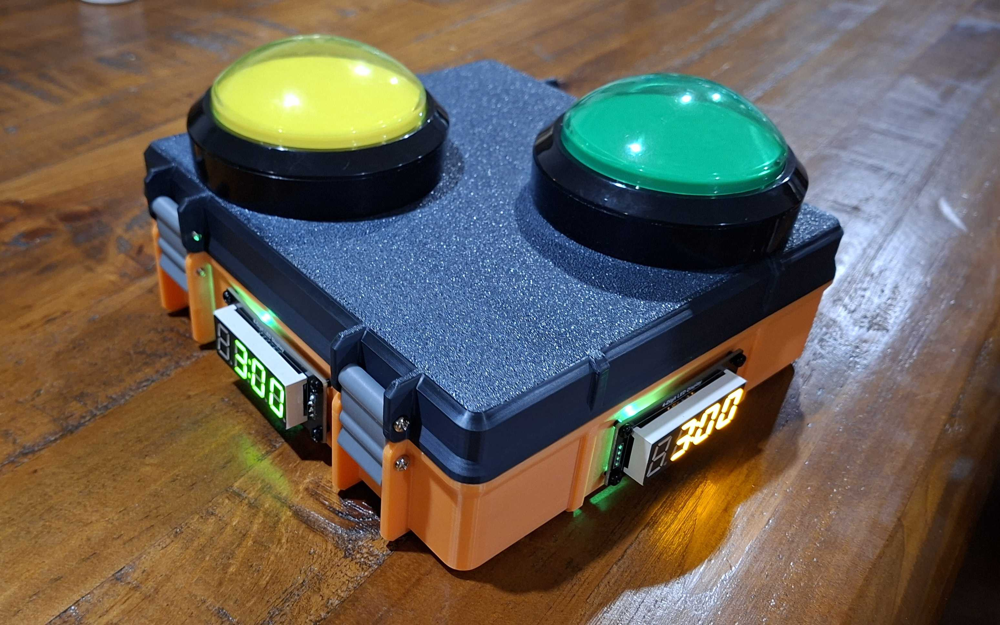
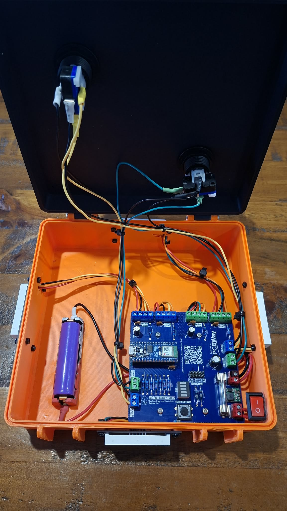
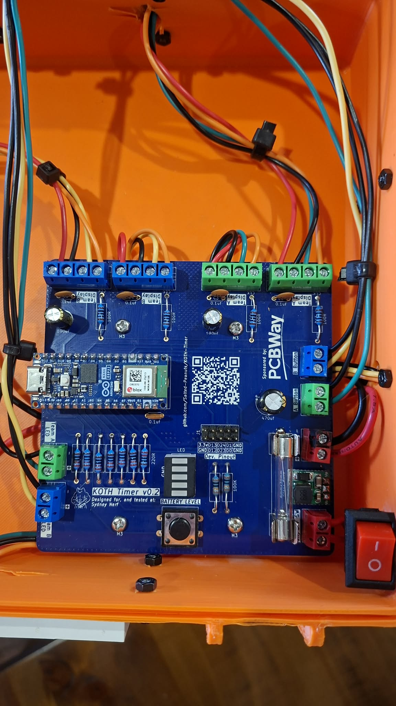

# KOTH-Timer

A DIY Arduino Nano ESP32 King of the Hill timer for Nerf, foam flinging, skirmish games, and other objective-based events.

KOTH-Timer is an open-source physical game timer with two large team buttons, four TM1637 displays, battery monitoring, optional audible feedback, and a local phone-friendly referee/admin web interface. It runs entirely on the ESP32 and does not require internet access during gameplay.

This repository is based on a working timer that has been used at local Nerf events and then iterated into a documented PCB-based build.

## Current recommended versions

**Firmware:** `v0.4.0`

```text
Firmware/KOTH_Timer_v0_4_0/KOTH_Timer_v0_4_0.ino
```

**PCB:** `v0.2-tested`

```text
PCB/v0.2-tested/
```

PCB v0.2 is still the current tested PCB revision. An **updated PCB revision is currently being developed** to incorporate the newer hardware changes more cleanly.

> [!IMPORTANT]
> Firmware v0.4.0 changes the battery-voltage divider from **100 kΩ / 100 kΩ to 10 kΩ / 10 kΩ**.
>
> If you are upgrading an existing timer or assembling PCB v0.2 for v0.4.0, fit **10 kΩ at R1 and R2** before relying on the battery reading or low-battery protection.
>
> The new buzzer support is **optional**. The firmware still works normally with **no buzzer connected**; you simply will not hear the start, scoring, victory, or low-battery sounds.

See [Hardware changes for v0.4.0](docs/hardware-upgrade-v0.4.0.md) before upgrading an existing build.

## What it does

Each team has its own countdown timer. During a running match:

- Team A counts down while only Team A's button is held.
- Team B counts down while only Team B's button is held.
- Both buttons held = contested; neither team scores.
- No buttons held = no scoring.
- The first team to run its timer to zero wins.

The timer can be operated through the local referee webpage, and v0.4.0 also supports starting a match directly from the physical team buttons.

## v0.4.0 highlights

- Hold both team buttons for 5 seconds to start a match without a phone.
- Audible start countdown with an **optional active buzzer** on D13.
- Short scoring chirps, victory sound, and low-battery alarm when a buzzer is fitted.
- Improved winner animation on the TM1637 displays.
- Reworked battery monitoring using a 10 kΩ / 10 kΩ divider.
- Five-segment battery indicator with revised voltage thresholds.
- Critical low-battery warning below 3.40 V.
- Automatic freeze and non-volatile game-state save during a critical battery condition.
- Restores an interrupted match in a paused state after a battery swap/reboot.
- Cleaner referee/admin webpage and improved control-state handling.
- Captive-portal / automatic webpage launching removed in favour of a reliable manual connection.

Full details: [v0.4.0 release notes](docs/release-notes-v0.4.0.md)

## Referee/admin connection

The timer creates its own local Wi-Fi network:

```text
SSID: KOTH-Timer
Password: none / open network
```

After connecting, manually open:

```text
http://10.10.10.1/
```

Connection test:

```text
http://10.10.10.1/ping
```

Automatic browser/captive-portal opening is intentionally not used in v0.4.0. Some phones or laptops may report that the network has no internet; choose the option to stay connected/use the network anyway.

## Physical controls

In addition to the webpage controls, v0.4.0 supports a physical start sequence.

When the match is stopped, hold **both team buttons for 5 seconds**.

With the optional buzzer fitted:

```text
BEEP ... BEEP ... BEEEEEEP
                    ^
                    GO
```

The match goes live at the start of the long beep. If both buttons are still held at that moment, the hill starts contested and neither team scores until only one team button remains held.

Without a buzzer fitted, the firmware still functions; the start sequence simply has no audible countdown.

## Hardware overview

The current build uses:

- Arduino Nano ESP32
- single 18650 Li-ion cell
- 5 V boost converter
- fuse and main power switch
- 2 large arcade team buttons with LEDs
- 4 TM1637 4-digit displays
- 5-segment battery indicator
- battery-check button
- **2 × 10 kΩ resistors for the battery divider**
- LED current-limiting resistors
- optional 3.3–5 V active buzzer module
- prototype wiring or PCB v0.2

The reviewed BOM is available in:

```text
docs/BOM.csv
docs/BOM.xlsx
```

## PCB hardware status

| PCB revision | Status | Recommendation |
|---|---|---|
| `v0.1` | Manufactured; known TM1637 display reliability issues | Reference only |
| `v0.2` | Manufactured, assembled and tested with no known PCB faults | Current tested PCB; use v0.4 hardware substitutions below |
| Next revision | In development | Will integrate the newer v0.4 hardware changes more cleanly |

### PCB v0.2 and firmware v0.4.0

PCB v0.2 remains usable with v0.4.0.

For a v0.4.0 build:

- fit **10 kΩ** resistors at **R1 and R2** instead of the 100 kΩ values shown in the original v0.2 files;
- optionally connect a 3.3–5 V **active buzzer** using **D13, 3.3 V and GND**;
- leave the buzzer disconnected if audible feedback is not wanted.

The v0.2 KiCad/Gerber files are kept as the record of the tested manufactured revision, so they are **not being silently rewritten** to pretend the newer changes were part of the original tested board.

## PCBWay project

The tested PCB v0.2 is also published on PCBWay:

[Order / view the KOTH Timer PCB v0.2 project on PCBWay](https://www.pcbway.com/project/shareproject/King_Of_The_Hill_ESP32_based_timer_1aeedfa7.html)

That PCBWay page reflects the older v0.2 hardware/release material. For firmware v0.4.0, follow this repository's current BOM and hardware-upgrade notes.

## Build documentation

Start with:

- [Build guide](docs/build-guide.md)
- [v0.4.0 hardware upgrade notes](docs/hardware-upgrade-v0.4.0.md)
- [v0.4.0 release notes](docs/release-notes-v0.4.0.md)
- [Documentation index](docs/README.md)

## Prototype photos

### Finished prototype



### Inside wiring



### Custom PCB



## Firmware

The firmware is written for the Arduino Nano ESP32 using the Arduino IDE.

For Arduino IDE compatibility, keep the sketch in a folder with the same base name:

```text
Firmware/
  KOTH_Timer_v0_4_0/
    KOTH_Timer_v0_4_0.ino
```

The external libraries used by the firmware are:

- WebSockets
- TM1637Display

Wi-Fi, WebServer and Preferences support are provided by the Arduino Nano ESP32 board package.

## Supported by PCBWay

PCB manufacturing for newer KOTH Timer PCB revisions has been supported by **PCBWay**.

[PCBWay](https://pcbway.com/g/EGJ27l)

Their manufacturing support helped move the project from a hand-wired prototype to tested PCB revisions while keeping the firmware, design files, known issues and documentation open source.

PCBWay support does not change the testing notes or recommendations in this repository; those are documented independently.

## Project status

This is an open-source hobby project, not a commercial product.

Builders should inspect the schematic/BOM, verify their own wiring, and bench-test the timer before event use. In particular, test the v0.4.0 battery warning/recovery behaviour after changing the divider resistors.

## Licence

This project is released under the MIT Licence.
